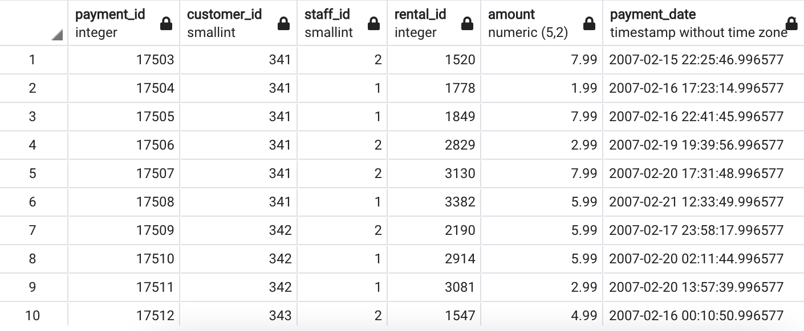
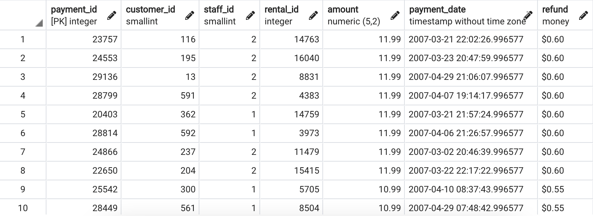
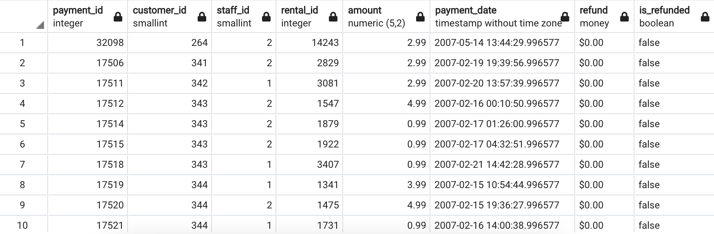
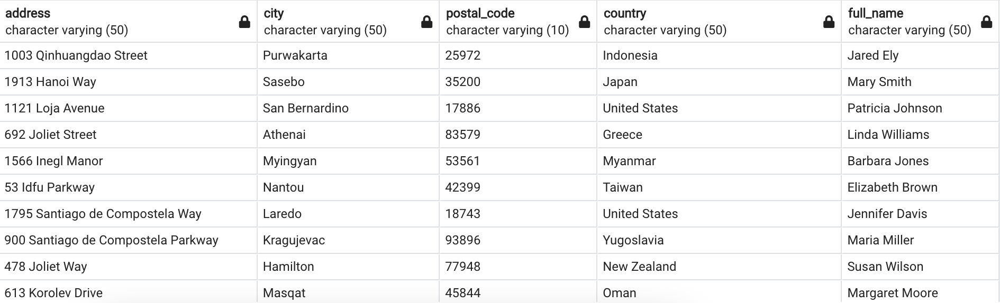
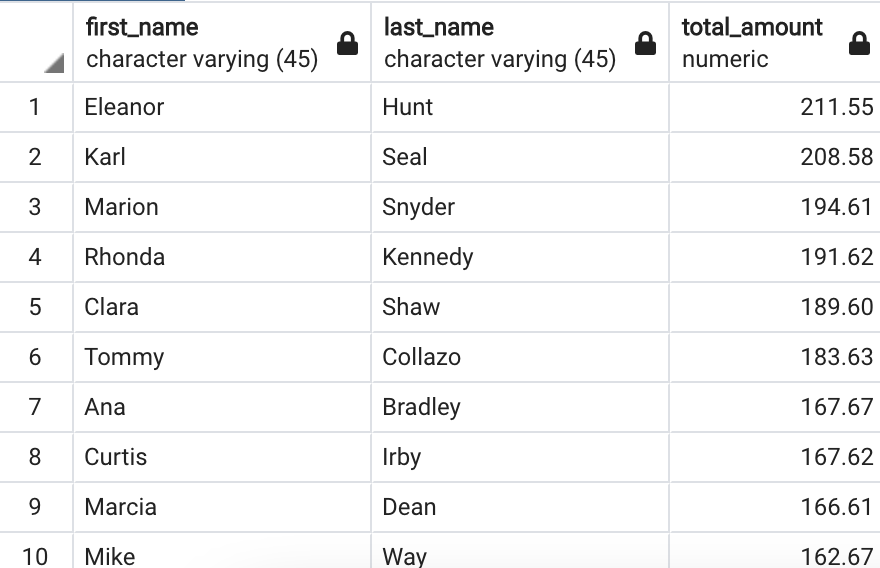

# Lab 02 Assignment: SQL Statements in PostgreSQL
<br> Radley Ciego <br>
<br> September 29, 2022 <br>
<br> GTECH 78519: Geospatial Databases <br>
<br> Lab 2, Q1: <br>

```sql
-- Make a copy of the payment table using CREATE TABLE ... AS
CREATE TABLE payment_bk AS
SELECT * FROM payment 
```

<br> Results in pgAdmin: <br>



<br> Lab 2, Q2: <br>

```sql
/* For a holiday promotion, the store plans to give 5% refund to the rental payment that is greater than $5.00. 
Add a new refund column of money type to the payment table and update the column values according to this
new promotion policy.*/ 

 ALTER TABLE payment
 ADD COLUMN refund money;

 UPDATE payment
 SET refund = (0.05*amount)::money
 WHERE amount > 5.00
```

<br> Results in pgAdmin: <br>



<br> Lab 2, Q3: <br>

```sql
/* Create a new view using the updated payment table but with a new Boolean column is_refunded 
indicating if a refund is available. */

CREATE VIEW payment_view AS 
SELECT *, (refund::numeric)>0 AS is_refunded
FROM payment
ORDER BY refund DESC;
```

<br> Results in pgAdmin: <br>



<br>Lab 2, Q4: <br>

```sql
/* Use JOIN to create a customer_contact table with all customers’ full name, address, city, zip code, 
and country. Note that you need to create a new column for the full name and update its values
from first name and last name. (Tip: Join country, city, and customer tables) */
CREATE TABLE customer_contact AS (
SELECT cu.first_name  cu.last_name, address, city, postal_code, country
FROM customer cu
JOIN address a ON cu.address_id = a.address_id
JOIN city ci ON a.city_id = ci.city_id
JOIN country co ON ci.country_id = co.country_id);

ALTER TABLE customer_contact
ADD COLUMN full_name varchar(100);

UPDATE customer_contact
SET full_name = first_name || ' ' || last_name;

ALTER TABLE customer_contact
DROP COLUMN first_name,
DROP COLUMN last_name;
```
<br> Results in pgAdmin: <br>



<br> Lab 4, Q5: <br>

``` sql
/* Find the "10 Most Valuable Customers" who spent the most on the rentals. (Tips: need to join relevant tables, summarize the total for payments, and sort the results). */
SELECT first_name, last_name, amount
FROM customer cu
JOIN payment p ON cu.customer_id = p.customer_id);
GROUP BY first_name, last_name
ORDER BY SUM(amount) DESC
LIMIT 10
```

<br> Results on pgAdmin: <br>
